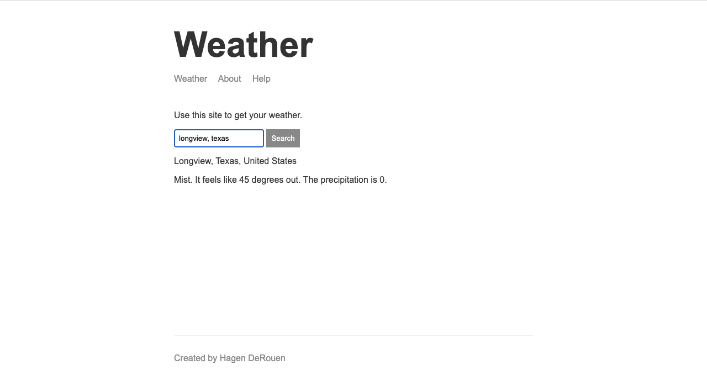

# node-weather-website

A website to get your local weather. It integrates [weatherstack](https://weatherstack.com/) and geolocation using [mapbox](https://www.mapbox.com/). Built with [Node](https://nodejs.org/en/).

[View live](https://hagen-weather-application.herokuapp.com/)

Special thanks to [Andrew Mead](https://www.udemy.com/user/andrewmead/)!